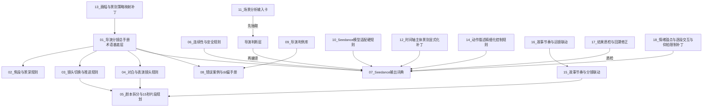
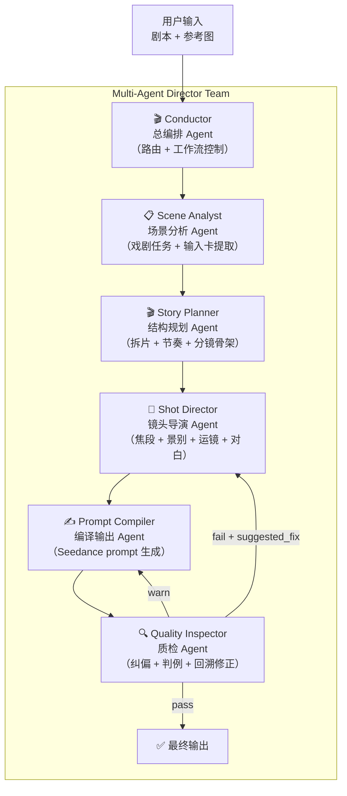

# 智能导演 GPTs → 多 Agent 团队迁移方案

## 一、问题背景

当前你的 GPTs 应用包含 **18 个知识库文件 + 1 个指令文件**，总计约 **145KB** 的专业导演知识。这些知识涵盖了从基础术语定义到最终 Seedance prompt 输出的完整导演工作流。

### GPTs 无法胜任的核心原因

| 问题 | 具体表现 |
|------|----------|
| **上下文窗口不够** | 18 个文件 ≈ 145KB ≈ ~50,000 汉字，远超 GPTs 单轮能稳定使用的上下文容量 |
| **文件优先级丢失** | GPTs 无法保证每轮都按正确顺序查阅 18 个文件 |
| **模式路由困难** | 审稿模式 / 纯编译模式 / 纠错模式的切换在 GPTs 中极不稳定 |
| **多步推理退化** | 导演判断→拆片→分镜→编译的多步流水线在单 Agent 中容易滑回混写 |
| **质检缺失** | 无法在同一个 Agent 中同时"创作"和"质检" |

---

## 二、配置文件分析与知识分层

### 2.1 现有文件关系图谱



### 2.2 知识功能分层

经过分析，18个文件可以清晰地分为 **5 个功能层**：

| 层级 | 功能 | 包含文件 |
|------|------|----------|
| **Layer 0：术语基底** | 定义、查表用 | 01（景别/机位/角度/运镜定义） |
| **Layer 1：导演判断规则** | 决定怎么拍 | 02（焦段景深）、03（镜头切换）、04（对白表演）、06（连续性安全）、13（画幅策略）、14（动作精细化）、18（情绪锚点/仰拍限制） |
| **Layer 2：结构规划规则** | 决定怎么拆 | 05（15秒拆片）、15（故事节奏与分镜联动）、16（故事节奏与运镜联动） |
| **Layer 3：输出编译规则** | 决定怎么写 | 07（Seedance词典）、10（模型适配硬规则）、12（景别显式化补丁） |
| **Layer 4：质量保障** | 决定对不对 | 08（错误案例纠偏）、09（导演判例库）、11（场景分析输入卡）、17（结果质检） |

---

## 三、配置文件优化建议

> [!IMPORTANT]
> 以下优化 **保持大框架不变**，只做合并降噪和消除冗余，目标是让每个 Agent 的知识包更精简。

### 3.1 可合并的文件

| 合并方案 | 原文件 | 理由 |
|----------|--------|------|
| **合并为 `02_焦段景深与景别策略.md`** | 02 + 13 | 13 是 02 的画幅适配补丁，逻辑强耦合 |
| **合并为 `07_Seedance输出词典与适配规则.md`** | 07 + 10 + 12 | 三者都是最终输出层规则，07 是主体，10 和 12 都是补丁 |
| **合并为 `08_错误纠偏与判例库.md`** | 08 + 09 | 09 判例库本质上是 08 的扩展案例 |
| **合并为 `15_故事节奏控制规则.md`** | 15 + 16 | 15 负责分镜联动，16 负责运镜联动，本质是节奏的两个面 |
| **保持 18 独立但内联拆分** | 18 | 18 涵盖4个独立主题（情绪锚点/逐段交互/仰拍限制/道具连续性），建议按 Agent 拆到不同知识包 |

### 3.2 优化后文件清单（11 个核心文件）

| 编号 | 文件名 | 原文件来源 |
|------|--------|------------|
| 01 | 导演分镜总手册（术语基底） | 原 01 |
| 02 | 焦段景深与景别画幅策略 | 原 02 + 13 |
| 03 | 镜头切换与推进规则 | 原 03 |
| 04 | 对白与表演镜头规则 | 原 04 |
| 05 | 剧本拆分与15秒片段规划 | 原 05 |
| 06 | 连续性与安全规则 | 原 06 |
| 07 | Seedance输出词典与模型适配（含景别显式化） | 原 07 + 10 + 12 |
| 08 | 错误纠偏手册与导演判例库 | 原 08 + 09 |
| 11 | 场景分析输入卡与导演意图提取 | 原 11 |
| 14 | 动作描述精细化控制规则 | 原 14 |
| 15 | 故事节奏控制规则（分镜+运镜联动） | 原 15 + 16 |
| 17 | 结果质检与回溯修正规则 | 原 17 |
| 18 | 情绪锚点与仰拍限制与道具连续性补丁 | 原 18（逐段交互规则提取到编排层） |

---

## 四、多 Agent 团队架构设计

### 4.1 Agent 角色划分



### 4.2 各 Agent 详细职责与知识分配

---

#### Agent 1：🎬 Conductor（总编排）

**职责：** 工作流路由与状态管理

| 项目 | 内容 |
|------|------|
| **核心功能** | 接收用户输入，判断任务类型（新编/重编/纠错/最小修正），路由到正确的 Agent 流程 |
| **模式路由** | 审稿模式 vs 纯编译模式 vs 风格记录模式 |
| **状态管理** | 管理逐段交互工作流、尾帧静帧接续、片段进度 |
| **知识包** | 无专项知识文件，只需 System Prompt 定义路由规则 |
| **关键规则** | 从 18 提取的"逐段交互式输出规则"（规则06-09） |

---

#### Agent 2：📋 Scene Analyst（场景分析）

**职责：** 戏剧任务分析 + 输入卡填充

| 项目 | 内容 |
|------|------|
| **核心功能** | 从剧本提取戏剧任务、主体、说话者、受击者、炸点、动作段、完整发言单元 |
| **输出产物** | `story_analysis.yaml`（填好的输入卡） |
| **知识包** | 11（场景分析输入卡，完整版） |
| **参考知识** | 01（术语查表）、04 的规则01-08（完整发言单元判断） |

---

#### Agent 3：🎬 Story Planner（结构规划）

**职责：** 拆片 + 节奏规划 + 主分镜骨架

| 项目 | 内容 |
|------|------|
| **核心功能** | 按戏剧动作拆15秒片段，判断节拍功能，建立主分镜/子分镜骨架 |
| **输出产物** | `pacing_plan.yaml`（拆片方案 + 节奏规划） |
| **知识包** | 05（拆片规则）、15（故事节奏控制规则，含分镜+运镜联动） |
| **参考知识** | 03（主分镜/子分镜层级判断）、01（术语） |

---

#### Agent 4：🎥 Shot Director（镜头导演）

**职责：** 每个分镜的具体镜头设计

| 项目 | 内容 |
|------|------|
| **核心功能** | 决定每个分镜的焦段、景深、景别、机位、角度、运镜、对白嵌入、动作描述、情绪锚点 |
| **输出产物** | `shot_plan.yaml` + `motion_plan.yaml` |
| **知识包** | 01（术语基底）、02（焦段景深+画幅策略）、03（镜头切换）、04（对白表演）、06（连续性安全）、14（动作精细化）、18（情绪锚点+仰拍限制+道具连续性） |

> [!NOTE]
> 这是知识量最大的 Agent，但因为只负责"镜头设计"这一个环节，不做拆片也不做编译，上下文压力大幅降低。

---

#### Agent 5：✍️ Prompt Compiler（编译输出）

**职责：** 将镜头设计编译为最终 Seedance prompt

| 项目 | 内容 |
|------|------|
| **核心功能** | 按 Seedance 输出词典格式编译：角色参考总控→空间首帧总控→时间轴→约束→参考调用 |
| **输出产物** | `final_prompt.md` |
| **知识包** | 07（Seedance输出词典+模型适配+景别显式化） |
| **参考知识** | 01（术语查表）、06的参考图规则 |

---

#### Agent 6：🔍 Quality Inspector（质检）

**职责：** 最终质检 + 纠偏建议

| 项目 | 内容 |
|------|------|
| **核心功能** | 检查拆片/镜头/动作/运镜/Prompt，输出 pass/warn/fail |
| **输出产物** | `qc_report.yaml` |
| **知识包** | 08（错误纠偏+判例库）、17（质检规则） |
| **回路** | fail → 指定 target_agent 返回重做；warn → 建议修改 |

---

### 4.3 数据流架构

```mermaid
sequenceDiagram
    participant U as 用户
    participant C as Conductor
    participant A as Scene Analyst
    participant P as Story Planner
    participant D as Shot Director
    participant W as Prompt Compiler
    participant Q as Quality Inspector

    U->>C: 剧本 + 参考图 + 画幅
    C->>C: 判断任务类型、画幅、模式
    
    rect rgb(40, 60, 80)
        Note over C,Q: 阶段一：整场分析与拆片
        C->>A: 传入剧本
        A->>A: 填充 story_analysis.yaml
        A->>P: 传入 story_analysis
        P->>P: 生成 pacing_plan.yaml
        P->>C: 返回拆片方案
        C->>U: 展示拆片方案，请求确认
        U->>C: 确认拆片
    end

    rect rgb(60, 40, 80)
        Note over C,Q: 阶段二：逐段生成（每段循环）
        C->>D: 传入当前片段 + pacing_plan + 参考图
        D->>D: 生成 shot_plan + motion_plan
        D->>W: 传入 shot/motion plan
        W->>W: 编译 final_prompt.md
        W->>Q: 传入所有中间产物
        Q->>Q: 质检
        alt pass
            Q->>C: pass
            C->>U: 输出当前片段 prompt
            U->>C: 上传尾帧图
            Note over C: 下一片段循环
        else fail
            Q->>C: fail + target_agent + issue
            C->>D: 回传修改指令
            Note over D,Q: 重新走 D→W→Q
        end
    end
```



---

## 五、多 Agent 框架选型

### 5.1 候选框架对比

| 框架 | 优势 | 劣势 | 适配度 |
|------|------|------|--------|
| **CrewAI** | 角色化团队概念，直觉匹配导演团队；上手最快 | 复杂循环逻辑略弱；状态持久化不如 LangGraph | ⭐⭐⭐⭐⭐ |
| **LangGraph** | 极致控制力；状态持久化+检查点；人在回路 | 学习曲线陡；代码量大 | ⭐⭐⭐⭐ |
| **OpenAI Agents SDK** | 轻量极简；原生 OpenAI 集成；Handoff 模式 | 生态较封闭；依赖 OpenAI API | ⭐⭐⭐ |
| **Microsoft AutoGen** | 对话式协作；多视角讨论 | 正整合进微软战略，未来不确定 | ⭐⭐ |

### 5.2 推荐方案

> [!IMPORTANT]
> **首选推荐：CrewAI**
> 
> 理由：
> 1. 你的工作流是**角色分工型流水线**（分析→规划→导演→编译→质检），这正是 CrewAI "角色+团队+任务" 的核心模型
> 2. 上手速度最快，几小时即可跑通原型
> 3. 支持 Sequential / Hierarchical 两种流程模式，足以覆盖你的需求
> 4. 每个 Agent 可绑定不同 LLM（如 Scene Analyst 用便宜模型、Shot Director 用强模型）

> [!TIP]
> **备选推荐：LangGraph**
> 
> 如果你未来需要：
> - 质检失败的精确回路控制
> - 长时间运行的状态检查点/恢复
> - 更复杂的条件分支
> 那 LangGraph 更适合。但前期建设成本更高。

### 5.3 CrewAI 映射示例

```python
from crewai import Agent, Task, Crew, Process

# === Agent 定义 ===
scene_analyst = Agent(
    role="场景分析师",
    goal="从剧本提取戏剧任务、主体、炸点、完整发言单元，填充输入卡",
    backstory="你是资深剧本分析师，擅长识别戏剧动作段和信息炸点",
    tools=[],  # 可接入剧本解析工具
    llm="gpt-4o",  # 或其他模型
)

story_planner = Agent(
    role="结构规划师",
    goal="按戏剧动作拆15秒片段，规划节奏，建立主分镜/子分镜骨架",
    backstory="你是分镜结构工程师，判断节拍功能和片段边界",
    tools=[],
    llm="gpt-4o",
)

shot_director = Agent(
    role="镜头导演",
    goal="为每个分镜设计焦段、景别、机位、运镜、对白嵌入、动作描述",
    backstory="你是一流摄影导演，精通镜头语言与情绪表达",
    tools=[],
    llm="claude-opus",  # 最强模型，应对最复杂任务
)

prompt_compiler = Agent(
    role="Seedance编译师",
    goal="将镜头设计编译为结构化Seedance中文prompt",
    backstory="你是视频生成prompt工程师，精通Seedance模型的表达偏好",
    tools=[],
    llm="gpt-4o",
)

quality_inspector = Agent(
    role="质检导演",
    goal="检查最终产物是否符合所有导演规则，输出pass/warn/fail",
    backstory="你是导演监制，只负责查错不负责创作",
    tools=[],
    llm="gpt-4o",
)

# === Task 定义 ===
analyze_task = Task(
    description="分析剧本场景，填充 story_analysis 输入卡",
    agent=scene_analyst,
    expected_output="完整的 story_analysis YAML",
)

plan_task = Task(
    description="基于场景分析，完成拆片方案和节奏规划",
    agent=story_planner,
    expected_output="pacing_plan YAML",
)

direct_task = Task(
    description="为当前片段设计详细镜头方案",
    agent=shot_director,
    expected_output="shot_plan + motion_plan YAML",
)

compile_task = Task(
    description="编译最终 Seedance prompt",
    agent=prompt_compiler,
    expected_output="final_prompt.md",
)

inspect_task = Task(
    description="质检所有中间产物和最终prompt",
    agent=quality_inspector,
    expected_output="qc_report（pass/warn/fail）",
)

# === Crew 组装 ===
director_crew = Crew(
    agents=[scene_analyst, story_planner, shot_director, 
            prompt_compiler, quality_inspector],
    tasks=[analyze_task, plan_task, direct_task, 
           compile_task, inspect_task],
    process=Process.sequential,  # 顺序执行
    verbose=True,
)

# === 执行 ===
result = director_crew.kickoff(inputs={"script": "...", "aspect_ratio": "16:9"})
```

---

## 六、实施路线图

### Phase 1：知识优化（1-2天）
- [ ] 按 3.2 方案合并知识文件（18→13个）
- [ ] 为每个 Agent 裁剪专属知识包
- [ ] 编写每个 Agent 的 System Prompt

### Phase 2：原型搭建（2-3天）
- [ ] 安装 CrewAI（`pip install crewai`）
- [ ] 定义 5 个 Agent + 5 个 Task
- [ ] 用 1 个简单剧本跑通全流程
- [ ] 验证逐段交互工作流

### Phase 3：知识注入（2-3天）
- [ ] 将合并后的知识文件注入各 Agent 的 system prompt 或 RAG
- [ ] 调试质检回路（fail → 回传修改）
- [ ] 测试多场景（对白戏/动作戏/情绪戏）

### Phase 4：生产化（3-5天）
- [ ] 接入你的 OpenClaw/storyboard-brain-tool 生态
- [ ] 添加尾帧图上传和分析流程
- [ ] 添加参考图管理
- [ ] 部署为可调用服务

---

## 七、Open Questions

> [!IMPORTANT]
> 以下问题需要你确认后才能推进具体实施：

1. **LLM 选择**：你打算使用哪个底层模型？OpenAI GPT-4o / Claude / 本地 Ollama？不同 Agent 是否可以用不同模型？
2. **部署方式**：你希望这个多 Agent 系统是 CLI 工具、Web 服务、还是集成到现有的 OpenClaw/storyboard-brain-tool 项目？
3. **知识注入方式**：你倾向于把知识文件直接写入 System Prompt（简单但有长度限制），还是用 RAG 向量检索（更灵活但需要额外基础设施）？
4. **框架确认**：你倾向于先用 CrewAI 快速出原型，还是直接用 LangGraph 做更精细的控制？  
5. **是否先做知识文件优化**：我可以先帮你把 18 个文件按方案合并为 13 个，你确认后再搭 Agent 团队？
