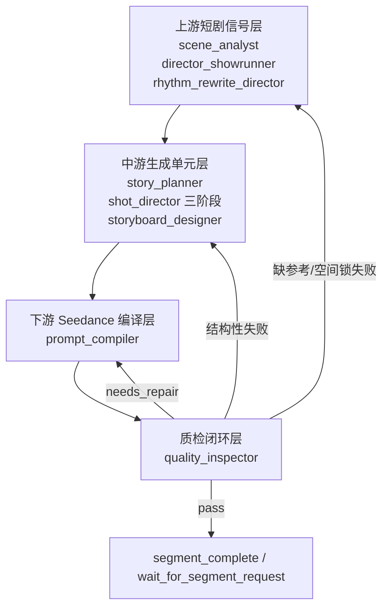

# Seedance 2.0 能力矩阵下的 Agent 合同整合报告

生成日期：2026-05-16  
目标：在不继续扩大“节奏控制”和“镜头 coverage”议题的前提下，明确其他 agent 如何围绕 Seedance 2.0 能力矩阵重构。  
范围：仅为系统级整合分析，不修改现有代码、规则卡或其他 agent 文件。

## 0. 依据与现状

本报告引用并继承以下项目材料：

- `D:\AI_Director_Studio\knowledge\rules\shared\SEEDANCE20-OMNI-CAPABILITY-MATRIX-001.md`
- `D:\AI_Director_Studio\knowledge\rules\shot_director\SEEDANCE20-COVERAGE-WHITELIST-001.md`
- `D:\AI_Director_Studio\knowledge\external_sources\short_drama_samples\rhythm_control_template_library_v1.yaml`
- `D:\AI_Director_Studio\knowledge\external_sources\short_drama_samples\shot_coverage_template_library_v1.yaml`
- `D:\AI_Director_Studio\output\short_drama_analysis_full_20260516_105744\short_drama_shot_director_report.md`
- `D:\AI_Director_Studio\output\short_drama_analysis_full_20260516_105744\shot_records.csv`
- `D:\AI_Director_Studio\output\short_drama_analysis_full_20260516_105744\analysis_summary.json`
- `D:\AI_Director_Studio\gpts\ai_director_video_starter\01_system_flow.md`
- `D:\AI_Director_Studio\knowledge\00_知识库优先级与冲突裁决规则.md`
- `D:\AI_Director_Studio\agents\director_graph_package\graph_api.py`
- `D:\AI_Director_Studio\agents\director_graph_package\runners.py`
- `D:\AI_Director_Studio\agents\director_graph_package\types.py`
- `D:\AI_Director_Studio\agents\knowledge_base.py`

现有样片学习基线：

- 样片目录：`H:\样片`
- 样片数量：94 集，全部为 9:16 竖屏。
- 已检测镜头：3410 个。
- 平均镜头时长：3.21 秒；中位数：1.92 秒；P25/P75：0.96 秒 / 3.84 秒。
- 景别粗估显示：半身、关系、环境类镜头占主导，CU/ECU 占比极低。
- 结论：短剧学习不能被理解为“多切特写”和“复杂实拍镜头复刻”，而应拆为短剧信号、生成单元、Seedance 编译约束、质检闭环。

## 1. 新的 Agent 分层

### 1.1 上游短剧信号层

职责不是生成镜头，而是把真人短剧经验压缩成 AI 可控的信号：

- `scene_analyst`：产出可控空间、参考资产职责、场景锁、缺图/缺道具降级卡。
- `director_showrunner`：产出短剧爽点、冲突类型、反转目标、情绪落点、必要因果补强。
- `rhythm_rewrite_director`：产出节奏诊断、时间预算、可压缩弱拍、不可省略落点、尾帧要求。

这一层只能产生“观众问题”和“戏剧信号”，不能下放具体镜头、复杂运镜或模型不可控动作。

### 1.2 中游生成单元层

职责是把上游信号转成 Seedance 可生成的片段资产：

- `story_planner`：把剧情拆成 AI 生成单元，每段只有一个核心可见事件、一个反应承接、一个情绪落点。
- `shot_director 三阶段`：从白名单和候选模板中选择可控 coverage，输出镜头任务、动作预算、尾帧状态。三阶段仍保留：layout、blocking、guard。
- `storyboard_designer`：弱化为首帧/关键帧控制卡，不再扩展成独立导演。

这一层的核心产物不是“漂亮分镜”，而是可被 Seedance 编译器验证的生成单元合同。

### 1.3 下游 Seedance 编译层

`prompt_compiler` 是 Seedance 2.0 能力矩阵的实际编译器：

- 把上游/中游合同降级成短句、明确主体、明确动作、明确空间、明确尾帧。
- 对参考资产执行单一职责绑定：identity、scene、prop、motion、camera、audio。
- 对复杂度超限的片段执行降级、拆分或打回，不重新发明镜头逻辑。

### 1.4 质检闭环层

`quality_inspector` 从“输出润色检查”升级为合同仲裁层：

- 同时检查短剧爽点和 AI 可控性。
- 发现复杂度超限、未绑定参考、未使用白名单/测试通过模板、尾帧不可继承时 fail。
- 修复路由应区分：编译措辞问题回 `prompt_compiler`；生成单元结构问题回 `story_planner/shot_director`；空间/参考缺失回 `scene_analyst`。

## 2. 现有 Agent 结论

| Agent | 结论 | Seedance 2.0 下的新定位 | 边界 |
|---|---|---|---|
| `scene_analyst` | 保留并重构 | 从普通场景分析升级为“可控空间与参考资产合同生产者” | 不拆片，不写镜头，不改剧情 |
| `director_showrunner` | 保留但收窄 | 只生产短剧信号：爽点、冲突、反转、情绪落点、必要因果补强 | 不输出复杂镜头，不新增事件事实 |
| `rhythm_rewrite_director` | 保留 | 已有节奏学习方向正确，继续作为时间/密度/落点合同生产者 | 不写机位，不强制具体 coverage |
| `story_planner` | 重构为核心 | 从“10-15 秒拆片”升级为“Seedance 生成单元规划器” | 不为镜头美学改写剧本内容 |
| `shot_director 三阶段` | 保留并收紧 | 保留 layout/blocking/guard，但只能选择或降级白名单/candidate coverage | 未测试真人手法只能 candidate，不能生产直用 |
| `storyboard_designer` | 弱化 | 从独立分镜图生成器弱化为首帧/关键帧控制卡生成器 | 不新增动作、不重排镜头、不盖过 prompt_compiler |
| `prompt_compiler` | 强化 | Seedance 2.0 profile 编译器与降级执行点 | 不重新导演，不新增剧情，不重切片段 |
| `quality_inspector` | 强化 | 合同仲裁与模型可控性 gate | 可打回，不跨职责直接重写上游内容 |

不建议新增独立 agent。Seedance 2.0 能力矩阵应作为跨 agent 合同和质检 gate 注入现有流程，而不是再增加一个“Seedance supervisor”。新增 agent 会增加状态源、修改权和回路复杂度，反而削弱现有 `prompt_compiler + quality_inspector` 的明确责任。

## 3. 跨 Agent 数据合同

### 3.1 字段生产、消费与修改权

| 字段/合同 | 生产者 | 消费者 | 有权修改者 | 说明 |
|---|---|---|---|---|
| `scene_input_card` | `scene_analyst` | `story_planner`, `shot_director_layout`, `prompt_compiler`, `quality_inspector` | `scene_analyst` | 九层输入卡，未知字段必须显式 `unknown/null`。 |
| `scene_lock` | `scene_analyst` | `story_planner`, `shot_director`, `prompt_compiler`, `quality_inspector` | `scene_analyst` | 固定空间、入口出口、主道具、站位和视线关系。 |
| `reference_bindings[]` | `scene_analyst` | `prompt_compiler`, `quality_inspector`, `storyboard_designer` | `scene_analyst` | 每个参考资产只承担一个主职责。 |
| `missing_reference_fallback` | `scene_analyst` | `prompt_compiler`, `quality_inspector`, `story_planner` | `scene_analyst` | 缺参考时的身份锚点、首帧锁和硬约束。 |
| `prop_gap_constraints` | `scene_analyst` | `director_showrunner`, `story_planner`, `shot_director_layout` | `scene_analyst`; `director_showrunner` 只能补因果 | 缺道具不能让下游猜。 |
| `dramatic_signal` | `director_showrunner` | `rhythm_rewrite_director`, `story_planner`, `shot_director`, `quality_inspector` | `director_showrunner` | 压迫、误会、认亲、揭穿、反击、沉默等短剧信号。 |
| `conflict_type` | `director_showrunner` | `story_planner`, `quality_inspector` | `director_showrunner` | 用于判断是否保留爽点，不直接决定镜头。 |
| `emotion_landing` | `director_showrunner` | `rhythm_rewrite_director`, `story_planner`, `shot_director`, `quality_inspector` | `director_showrunner` | 情绪落点必须可被动作/表情/视线表现。 |
| `rhythm_diagnosis` | `rhythm_rewrite_director` | `story_planner`, `shot_director`, `prompt_compiler`, `quality_inspector` | `rhythm_rewrite_director` | 对应 `rhythm_control_template_library_v1.yaml`。 |
| `segment_duration_policy` | `rhythm_rewrite_director` | `story_planner`, `prompt_compiler`, `quality_inspector` | `rhythm_rewrite_director`; `story_planner` 可按片段边界落地 | 时间预算，不是镜头表。 |
| `non_omittable_beats` | `rhythm_rewrite_director` | `story_planner`, `shot_director`, `quality_inspector` | `rhythm_rewrite_director` | 反应落点、身份揭示、道具爆点等不可被快切吞掉。 |
| `source_script_events` | `story_planner` | `shot_director`, `prompt_compiler`, `quality_inspector` | `story_planner` | 下游只能翻译，不得增删事件。 |
| `exact_dialogue_units` | `story_planner` | `shot_director`, `prompt_compiler`, `quality_inspector` | `story_planner` | 不允许被节奏或镜头阶段改台词。 |
| `state_contract.entry_state/exit_state` | `story_planner` | `shot_director`, `prompt_compiler`, `quality_inspector` | `story_planner` | 从 `scene_lock` 初始化，随片段推进改变。 |
| `generation_unit` | `story_planner` | `shot_director`, `prompt_compiler`, `quality_inspector` | `story_planner` | 每段一个核心可见事件、一个反应承接、一个情绪落点。 |
| `model_complexity_score` | `story_planner` 初评；`prompt_compiler` 复评 | `shot_director`, `quality_inspector` | `story_planner`, `prompt_compiler` | 命中 3-4 分必须降级/拆分；5 分以上禁止单段生成。 |
| `coverage_template_id` | `shot_director` | `prompt_compiler`, `quality_inspector`, `storyboard_designer` | `shot_director` | 必须来自 W1/W2/R1/X 或 candidate。 |
| `coverage_role` | `shot_director` | `prompt_compiler`, `quality_inspector` | `shot_director` | 建立关系、对白压力、受击反应、信息揭示、关系复位、尾帧保持等。 |
| `action_budget` | `shot_director_blocking` | `prompt_compiler`, `quality_inspector` | `shot_director_blocking`; `shot_director_guard` 可最小修复 | 一个镜头只承载一个主动作或主反应。 |
| `tail_state_card` | `shot_director_guard` | `prompt_compiler`, `quality_inspector`, 下一段 `scene_analyst/story_planner` | `shot_director_guard`; `quality_inspector` 可打回 | 位置、接触、道具、视线、距离必须可继承。 |
| `first_frame_card` | `storyboard_designer` | `prompt_compiler`, `quality_inspector` | `storyboard_designer` | 首帧/关键帧控制，不重写镜头顺序。 |
| `compiled_prompt` | `prompt_compiler` | `quality_inspector`, runtime output | `prompt_compiler` | Seedance 可执行自然语言，不泄露内部字段。 |
| `reference_role_map` | `prompt_compiler` | `quality_inspector` | `prompt_compiler`；源绑定来自 `scene_analyst` | 编译期确认每张参考的单一职责。 |
| `qc_result` | `quality_inspector` | `runners`, UI, 用户复审 | `quality_inspector` | pass / needs_repair / fail。 |
| `repair_route` | `quality_inspector` | `graph_api`, `runners` | `quality_inspector` | 指向 prompt、生成单元、镜头、场景/参考中的具体责任层。 |

### 3.2 修改权原则

1. 上游字段只能由上游 agent 修改；下游发现问题只能打回或提出修复请求。
2. `prompt_compiler` 有权降级表达，但无权新增剧情、重排片段或替换 coverage 模板。
3. `quality_inspector` 有权 fail 和路由，不应直接跨层重写上游事实。
4. 样片学习产物默认是 `candidate`，没有 Seedance 2.0 测试结果前不能进入 runtime rule。

## 4. 后续代码落地修改点（不在本报告中执行）

风险排序按“改动面 + 状态迁移 + 回归影响”估计。

### 高风险

1. `D:\AI_Director_Studio\agents\director_graph_package\graph_api.py`
   - 现状：主图中未显式串接 `shot_director` 与 `storyboard_designer`，`wait_for_segment_request` 后直接到 `prompt_compiler`。
   - 建议：把 per-segment 生成单元链显式化为 `wait_for_segment_request -> shot_director -> storyboard_designer(optional) -> prompt_compiler -> quality_inspector`，并保留现有人工 review / resume 行为。
   - 风险：会影响 LangGraph 节点路由、已有状态恢复、QC retry 和 UI 轮询。

2. `D:\AI_Director_Studio\agents\director_graph_package\types.py`
   - 建议新增结构化合同字段：`seedance_profile`, `scene_input_card`, `scene_lock`, `reference_bindings`, `generation_units`, `model_complexity_score_by_segment`, `coverage_template_id_by_segment`, `tail_state_cards`, `repair_route`。
   - 风险：状态文件、测试 fixtures、旧输出兼容都受影响。

3. `D:\AI_Director_Studio\agents\director_graph_package\runners.py`
   - 现状：人工 review 节点、phase rerun、downstream clear 已存在，但需要与新合同层对齐。
   - 建议：重排 `NEXT_REVIEW_AGENT_AFTER_APPROVAL` 和 `_PHASE_1_DOWNSTREAM_OUTPUT_KEYS`，让上游字段变化能清空中游/下游，编译失败不误清上游。
   - 风险：resume、partial rerun、shot_director 重跑和用户审批路径容易回归。

### 中风险

4. `D:\AI_Director_Studio\agents\director_graph_package\story_planner_impl.py`
   - 建议：把 `generation_unit`、`model_complexity_score`、`required_reference_role` 作为必填合同字段；严格执行“每段一个核心可见事件、一个反应承接、一个情绪落点”。
   - 风险：会提高 schema guard 严格度，旧剧本输入可能更容易被打回。

5. `D:\AI_Director_Studio\agents\director_graph_package\shot_director_impl.py`
   - 现状：三阶段工作流和镜头职责字段已有基础。
   - 建议：强制输出 `coverage_template_id`、`coverage_role`、`action_budget`、`reference_need`、`tail_state_card`，并把未测试手法标为 candidate。
   - 风险：对旧 shot_director 输出兼容有影响，但边界清晰。

6. `D:\AI_Director_Studio\agents\director_graph_package\prompt_compiler_impl.py`
   - 建议：增加 Seedance profile 编译 gate：复杂度复评、参考职责映射、白名单/候选模板状态、R1 必须有视频/关键帧参考。
   - 风险：会改变 prompt 输出形态，需要补充回归测试。

7. `D:\AI_Director_Studio\agents\director_graph_package\quality_inspector_impl.py`
   - 建议：把 QC 从文本规则检查升级为合同检查：复杂度、参考绑定、template_id、tail_state、runtime rule 状态、X 禁用模板。
   - 风险：会增加 fail 率，但能减少不可生成输出。

### 中低风险

8. `D:\AI_Director_Studio\agents\knowledge_base.py`
   - 现状：`get_agent_knowledge_files()` 已能按 agent scope 和 shared runtime rule 注入。
   - 建议：把 `SEEDANCE20-OMNI-CAPABILITY-MATRIX-001.md` 作为所有相关 agent 的 P0 runtime gate；把 `SEEDANCE20-COVERAGE-WHITELIST-001.md` 注入 `story_planner/shot_director/storyboard_designer/prompt_compiler/quality_inspector`。
   - 风险：检索范围扩大后 prompt token 和规则冲突裁决需要测试。

9. Prompt 模板与 wiki 合同：
   - `D:\AI_Director_Studio\gpts\ai_director_video_starter\01_system_flow.md`
   - `D:\AI_Director_Studio\gpts\ai_director_video_starter\02_intake_schema.md`
   - `D:\AI_Director_Studio\gpts\ai_director_video_starter\04_prompt_output_template.md`
   - `D:\AI_Director_Studio\knowledge\wiki\contracts\story_to_shot_contract.md`
   - `D:\AI_Director_Studio\knowledge\wiki\contracts\shot_to_prompt_contract.md`
   - `D:\AI_Director_Studio\knowledge\wiki\contracts\prompt_to_quality_contract.md`
   - 建议：把本报告的数据合同拆入正式 contract 文档。
   - 风险：主要是文档/提示词一致性风险。

### 低风险

10. 样片学习产物目录：
    - `D:\AI_Director_Studio\knowledge\external_sources\short_drama_samples\`
    - 建议：新增 candidate registry、Seedance 测试记录、whitelist 升级记录和 failure mode 索引。
    - 风险：不影响 runtime，适合作为第一批落地。

11. 测试：
    - 建议新增合同测试而不是只测文本片段：story planner schema、reference binding、template status、complexity gate、QC repair route。
    - 风险：低，但需要先稳定字段名。

## 5. 94 集样片继续学习入库流程

样片学习必须坚持 `candidate -> Seedance 测试 -> whitelist -> runtime rule`，不能把真人短剧手法直接写入运行规则。

### 5.1 Candidate

来源：

- `H:\样片`
- `D:\AI_Director_Studio\output\short_drama_analysis_full_20260516_105744\shot_records.csv`
- `D:\AI_Director_Studio\output\short_drama_analysis_full_20260516_105744\short_drama_shot_director_report.md`

每个候选模板必须补齐：

- `candidate_id`
- `source_episode`
- `source_shot_range`
- `dramatic_signal`
- `observed_coverage_pattern`
- `degraded_seedance_version`
- `model_complexity_score`
- `required_reference_role`
- `expected_tail_state`
- `failure_risk`
- `agent_consumers`

### 5.2 Seedance 测试

测试目标不是复刻真人镜头，而是验证降级版能否稳定生成：

- 输入必须包含最小参考职责：identity / scene / prop / motion / camera / audio 中需要哪些就写哪些。
- 测试状态：`untested`, `pass`, `pass_with_limits`, `fail`。
- 必须记录失败模式：人物漂移、空间翻面、动作失控、道具归属跳变、尾帧不可继承、嘴型/字幕误依赖、复杂运镜失败。

### 5.3 Whitelist

升级条件：

- `pass`：可进入 W1/W2。
- `pass_with_limits`：只能进入 W2 或 R1，并写清限制条件。
- `fail`：进入 failure mode 或 X 禁用区。
- 任何需要视频参考或关键帧序列才能成立的手法，只能进入 R1，不得升级为普通 W1。

白名单字段必须与 `SEEDANCE20-COVERAGE-WHITELIST-001.md` 对齐：

- `template_id`
- `template_name`
- `dramatic_signal`
- `duration_s`
- `main_subject`
- `supporting_subjects`
- `camera`
- `action_budget`
- `reference_need`
- `tail_state`
- `compiler_guard`

### 5.4 Runtime Rule

只有白名单验证稳定后，才允许进入运行时规则：

- 新增或更新 rule card。
- 写入 `owner_agent`、`agent_scope`、`priority`、`runtime_retrieval`、`retrieval_key`。
- 更新 `rule_registry.yaml` 或对应知识库索引。
- 增加 `quality_inspector` gate，确保未测试 candidate 不会被 prompt_compiler 误用。

## 6. 核心结论

1. Seedance 2.0 重构的关键不是新增 agent，而是把现有 agent 统一到“短剧信号 -> 生成单元 -> Seedance 编译 -> 质检闭环”的合同链。
2. `scene_analyst`、`director_showrunner`、`story_planner`、`prompt_compiler`、`quality_inspector` 都需要围绕 Seedance 能力矩阵重构；`storyboard_designer` 应弱化；`shot_director` 三阶段保留但收紧到白名单/候选模板体系。
3. 数据合同的修改权必须单向：上游生产事实与信号，中游生产生成单元，下游只编译和质检，不能反向发明。
4. 94 集样片后续学习只能先入 candidate，经过 Seedance 2.0 实测后再升 whitelist，最后才成为 runtime rule。
5. 第一批落地应优先做低风险的 candidate registry 与合同测试；图路由、状态类型和 runner 迁移属于高风险，需要 GitNexus impact 分析和分阶段提交。
